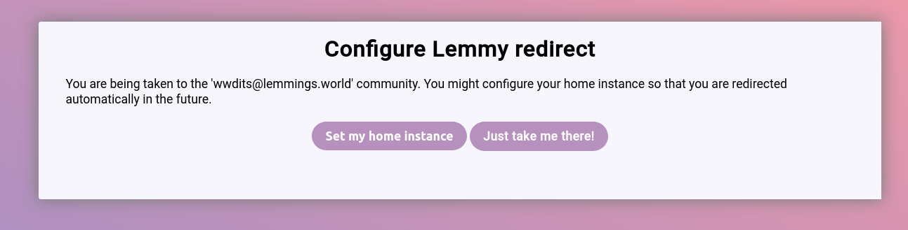

# Lemmyverse.link

This is a redirect service for linking to Lemmy communities throughout the internet. When you're on Lemmy, universal
links work (either in the form of relative link or the `!community_name@instance.tld` form).

But when linking to a Lemmy community from outside Lemmy, you face the problem of forcing the user to go to the instance
you linked to instead of their own.

Using this project you can create a link like this: `https://lemmings.link/c/community_name@instance.tld`, the user
will be given the option to set their home instance and every further link to `lemmings.link` will work as usual.

## Available domains

This project is currently hosted on:

- lemmyverse.link
- threadiverse.link

## Translating

If you'd like to translate this project to your language, run the following command:

`./bin/console translation:extract --force --format yaml [language]`

Replace `[language]` with your two-letter country code, for example for German it would be:

`./bin/console translation:extract --force --format yaml de`

Edit the file `translations/messages+intl-icu.[language].yaml`
